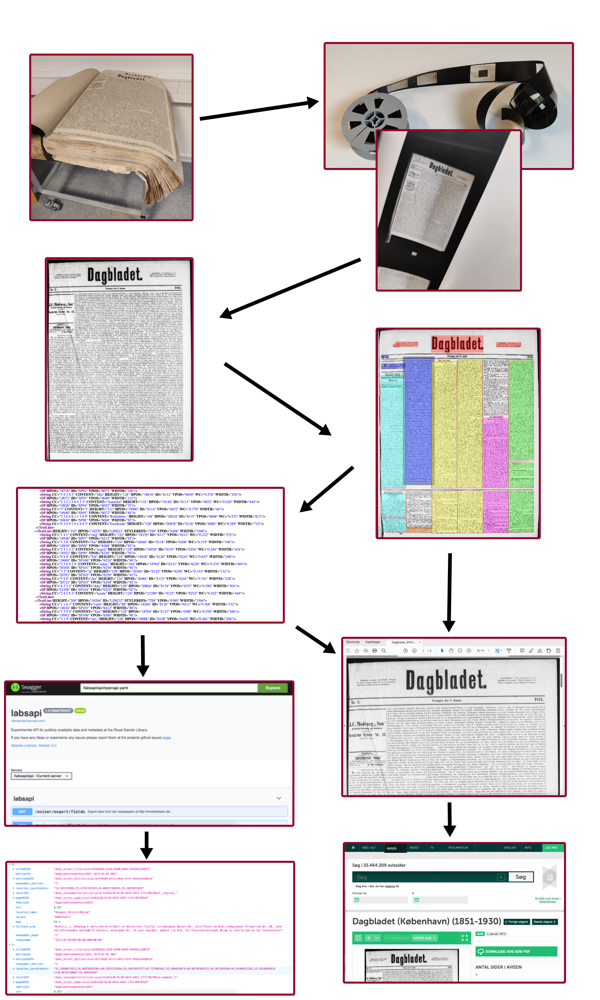

This particular lesson is written in R in the so called [R-markdown format](https://r4ds.had.co.nz/r-markdown.html). It is assumed that you have R and Rstudio installed. In this case you will be able to follow all steps by running the code in the grey boxes beneath. For further information on getting R and Rstudio see the [Prerequisites-section](https://r4ds.had.co.nz/introduction.html#prerequisites) of the book *R for Data Science*. 


This lesson is the first concrete example of how to interact with a specific API and we pick up exactly where we left in the previous lesson [What is an API?](https://github.com/maxodsbjerg/CHCAA_API_lesson/blob/main/what_is_an_API/what_is_an_API.md. The last thing we did in that lesson was to ask the Royal Danish Library's newspaper-API to tell us how many articles mentions "internet". The answer was returned in the JSON-format, which we will save for later, since the newspaper-API can also return answers in CSV-format, which will be the case of this example. CSV is short for Comma Separated Values and is a way of storing data in a raw text format. CSV-files are easily handled by most programming languages and especially R. The main focus of this lesson will therefore be on constructing an request URL to the Newspaper API as explained in the previous chapter. 


As a general rule of thumb it is always best to examine and understand the data that you're trying to extract and the service which stores them and how they make them available before you dive into the API. This process will be total dependent on the specific case and in our case with the Newspaper API it involves diving into what this collection contains. In the following section we will dive into a very short survey of the Danish Newspaper Collection's history. 

The collections exist because legal deposit of published material has been required by law in Denmark since 1697. In the light of this Danish Newspapers has been collected and stored for the future. This of course led to a lot of physical paper and eventually the library began to photograph the individual pages of each newspaper and store it on microfilm instead. Then in the period 2014-2017 these microfilms were digitized. This involved a computer running a segmentation algorithm, which runs through all these now digital pages and identifying which headers belonged to which paragraphs thus forming articles. Along with this the computer also recognized the text thus making it searchable. The process of recognizing the text is called [Optical Character Recognition(OCR)](https://en.wikipedia.org/wiki/Optical_character_recognition). Of course these processes were not precise and especially not on the older newspapers, which cause a lot off "misreading" of the OCR-text and in the segmentation of articles. The result of this process is a pdf-file that consist of "two" layers. One which is the actual picture of the newspaper pages and another layer containing the OCR text making the pdf-file searchable. 



 
The result is of course a lot of pdf-files, but there is also a lot of metadata around these pdf files. For example we have the time of publication, the publication place and which newspaper it is. This is of course a lot of data, so how do you make it easy for the public to search across the newspapers and their metadata? The answer is a graphical user interface that normal users can interact with. In the case of the newspaper collection this platform is called Mediestream. Let's use the graphical user interface on a specific case. Let's say that we want to find articles from the correspondent sent out by the newspaper "Dagbladet" regarding internal affairs in France and in Paris and the politician Charles de Rémusat in the year 1873. The screenshot below shows how the this search is performed in Mediestream. Red circles marks demarcation-elements of particular interest:


The top circle is the free text search. This is where we define that the word "correspondent", "paris" and "rémusat" must be present in the OCR text of the article that we are looking for. The next circle is where we define the time period of interest. In this case by pointing and clicking through months and years eventually defining from the 1. January 1873 to 31. December 1873 - in other words the entire year of 1873. The last circle is where we have defined that we only have interest in hits in the newspaper "Dagbladet". The results in 9 hits which means that 9 articles(identified as such in the segmentation process) meet our requirements.

This exact search could have been performed entirely from the free text search field using more advanced search codes. Behold this search: 


This results in the exact same. 9 hits from the newspaper "Dagbladet". So what has been done differently? Notice the free text search field - here we have appended "py:1873" to our search before. This is an "advanced" search code setting the publication year(py) to 1873. Notice how the time selector is blank - this is because it haven't been used. Furthermore the search code "familyId:dagbladetkoebenhavn1851" has been added, which says that we are only interested in results from the newspaper "Dagsbladet". Since "Dagsbladet" is a fairly popular name for at newspaper(imagine something like "Daily News") we are using a unique id for this particular newspaper. All the newspapers in Mediestream has been given unique ids to avoid ambiguity. Thus we end up with a search string that looks like this: 

> korrespondent AND paris AND rémusat AND py:1873 AND familyId:dagbladetkoebenhavn1851

In order to extract raw data from the newspaper API we need to be able to define the data that we are interested with these kind of advanced search strings. It is a good idea to test the search strings in Mediestream and once you are happy with the amount of hits you take your advanced search string to the API. For more help on constructing search strings see [The page for search advice in Mediestream](https://www2.statsbiblioteket.dk/mediestream/info/soegetips)

One important thing to add before venturing on is the limitations in access to the newspaper collection due to copyright. The is because of the newspapers being at the library due to the legal deposit of published material. Thus the material is still under copyright meaning that you can only see newspapers older than 100 years and in order to extract data from the newspaper API the material must be older than 140 years. 

Before venturing on to extracting data from the newspaper API with a search string let's create a string that has more than 9 hits by expanding the time range and removing rémusat, så as we get articles containing paris and korrespondent in the periode 1870 to 1875:
> korrespondent AND paris AND py:[1870 TO 1875] AND familyId:dagbladetkoebenhavn1851

This search gives us 644 hits. Now we have a some what large body of material and we wan't to employ some kind og digital method on them. This can't be done in the graphical user interface of Mediestream. We need to turn our focus to the API connected to Mediestream


# Newspaper API: Converting the search string to a request URL


Technical documentation and explanations on with fields are exported can be found on the [Swagger UI](http://labs.statsbiblioteket.dk/labsapi/api//api-docs?url=/labsapi/api/openapi.yaml)

# Loading relevant libraries

The dataset is processed in the software R, offering various methods for statistical analysis and graphic representation of the results. In R, one works with packages each adding numerous functionalities to the core functions of R. In this example, the relevant packages are:

Documentation for each package: <br>
*https://www.tidyverse.org/packages/ <br>
*https://cran.r-project.org/web/packages/tidytext/vignettes/tidytext.html <br>
*https://lubridate.tidyverse.org/ <br>
*https://ggplot2.tidyverse.org/ <br>
*https://cran.r-project.org/web/packages/ggwordcloud/vignettes/ggwordcloud.html<br>

Additional information about R: 
https://www.r-project.org/

```{r, message=FALSE}
library(tidyverse)
library(tidytext)
library(lubridate)
library(ggwordcloud)
```

# Loading data from St. Croix Avis 1878

The dataset is loaded into R. This is done via a retrieve link from the API. This link is created by the [Swagger UI](http://labs.statsbiblioteket.dk/labsapi/api//api-docs?url=/labsapi/api/openapi.yaml), which is documentation and user interface for the API. Here we have specified that we want newspaper data from the St. Croix Avis from the year 1878. This data is loaded into R with the `read_csv` function since we also have specified the data format to be CSV in the Swagger UI: 

```{r}
croix <- read_csv("http://labs.statsbiblioteket.dk/labsapi/api/aviser/export/fields?query=py%3A1878%20AND%20familyId%3Astcroixavisdvi&fields=link&fields=recordID&fields=timestamp&fields=pwa&fields=cer&fields=fulltext_org&fields=pageUUID&fields=editionUUID&fields=titleUUID&fields=editionId&fields=familyId&fields=newspaper_page&fields=newspaper_edition&fields=lplace&fields=location_name&fields=location_coordinates&max=5000&structure=header&structure=content&format=CSV")
```
CSV is short for Comma Separated Values that is a way of structuring a dataset in plain text. CSV files are structured in columns separated by commas and in rows separated by lines. Each row in the data correspond to identified articles by the segmentations-process during the digitisation process of the newspapers.  
In the output from the `read_csv`-function R tells us which columns are present in the dataset and what type of data it has recognised in the column's rows. Most of them are "col_character()", which means the rows in the column contains textual data (character signs). Others have the "col_double()", which means the rows in the column contains numbers. This is a question of datatypes, which can be very important when coding, but in the case of this workshop we won't work further with them.    
