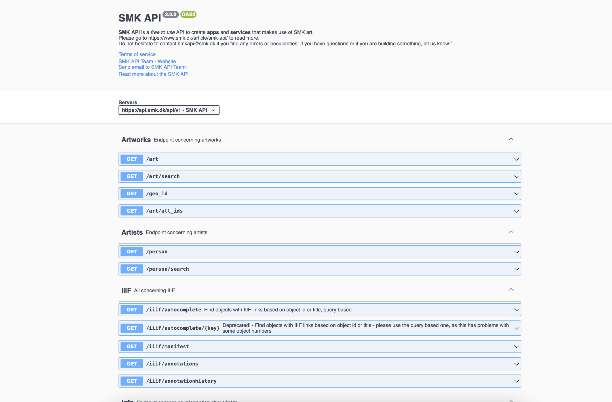
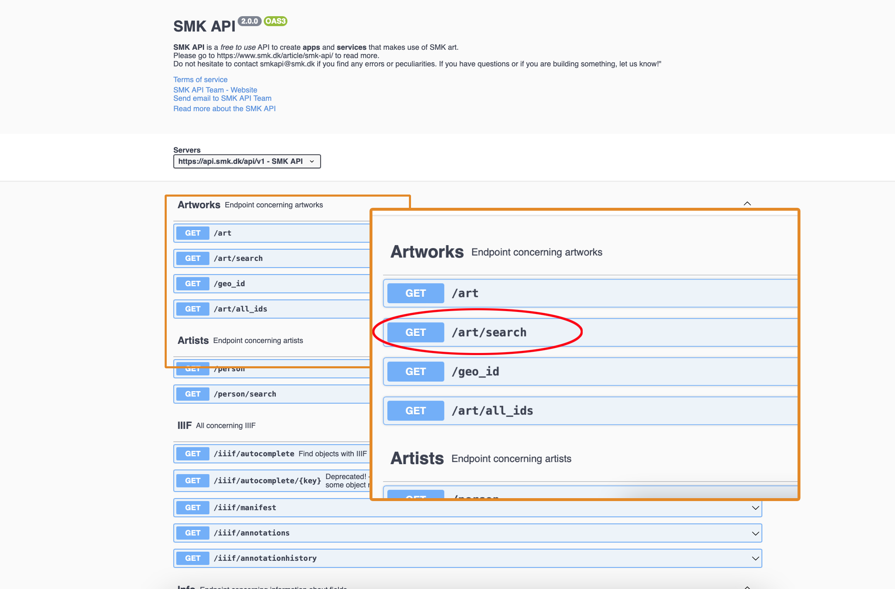
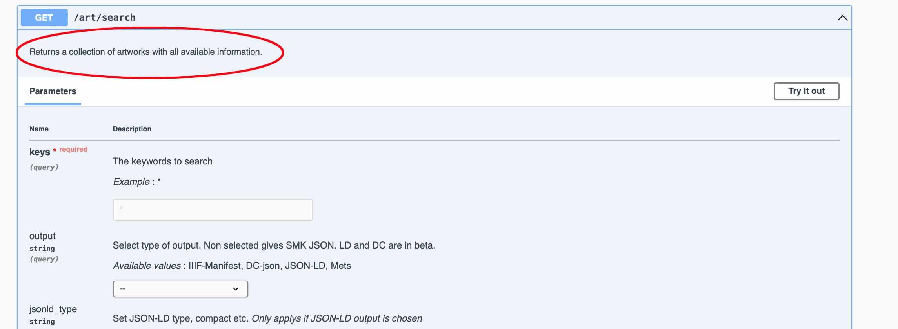
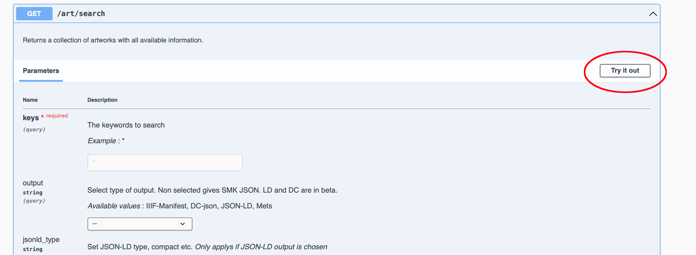
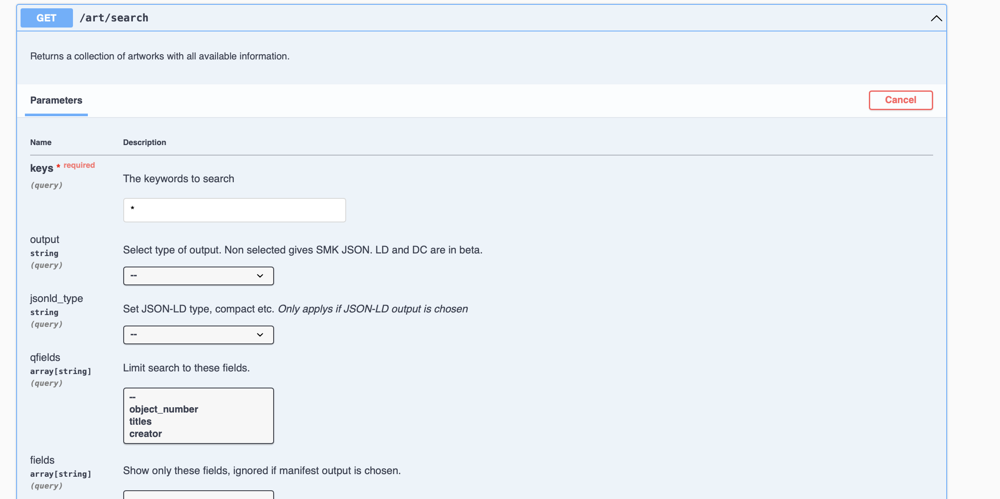
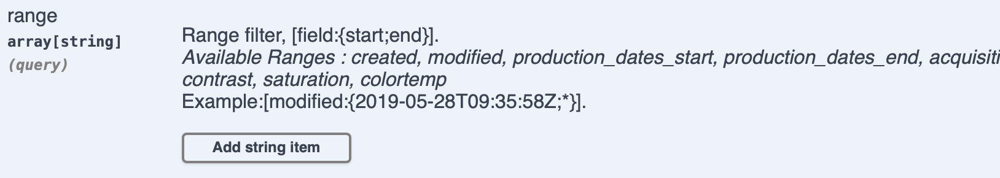
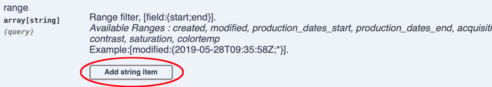
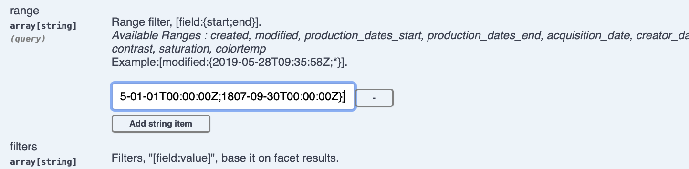
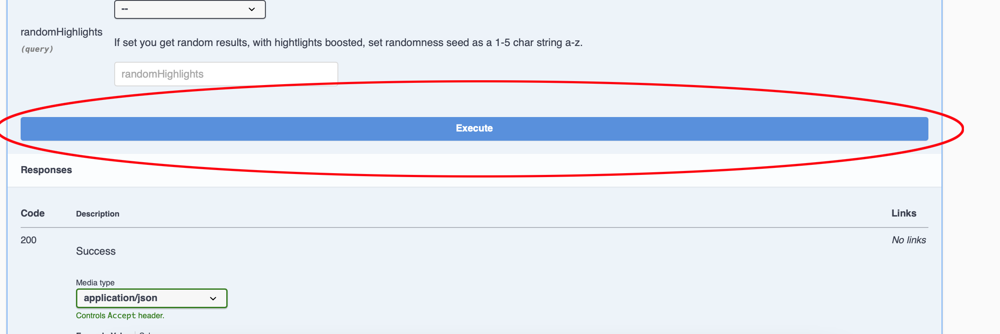
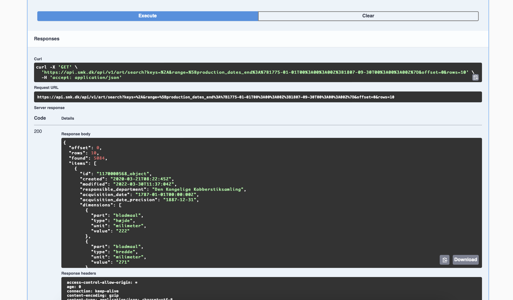

# Extracting art works from the flourishing period with the SMK API
The period from 1775 to the bombardment of Copenhagen in September 1807 was a time of mercantile flourishing in Denmark. This was due to Denmark's neutrality in the wars between the great powers of the period. Under this neutrality Denmark was able to increase trade making especially Copenhagen traders rich. But let's say that you want to examine this period in art. How do you extract the art works from the this flourishing period that lies within SMK?  
This will be the focus of this lesson, where it will be demonstrated how to use the SMK API swagger interface to construct a call to the API that extracts all the art works in SMK in the period from the first of January 1775 to the 30. September 1807.  
# The SMK swagger interface

When landing on the SMK Swagger interface it looks like this: 

Several sections are seen(Artworks, Artists IIIF, etc.). These a called endpoints and they are a kind of stands offering different services. The first one serves information on Artworks, the next information on Artist and so on. Since the focal point of this tutorial are artworks from the flourishing period the "Artworks"-stand are chosen.  
But there are several options here. In this case "/art/search" is chosen. 

Folding out an option will give more detail on what it does:

This is exactly what is wanted in this case: a collection of artworks from the flourishing period with all available information.  
The next step is to hit the "Try it out"-button: 

This gives the opportunity to modify all the fields in the formula:

The different fields can modify the query of the art works. The first field is "keys" which is required. This is the keyword that will be searched for. Since the case at hand isn't really looking for anything particular, the case want all the works from flourishing period, the star(it was there by default) in the keys-field. This returns everything. The next field is the output - which will be left untouched, but notice how the swagger interface gives information on each field. If nothing is selected the API will be serving the SMK JSON. This is fine for now. There is a lot of fields, which constitutes a lot of ways of modifying the result that the API returns. This is really handy in order to tweek the form and content of the data delivered by the API depending the current use case. But for now it is confusing and perhaps even a bit frightening. But that is okay. Imagine all of these fields as knobs and switches that control the output of the API. Let's keep the objective in mind: extracting all the art works from 1. January 1775 and 30. September 1807. **We need to find the field where you can put in a *range* of dates**.  
The next step is therefore to scroll down the swagger page and find the "range"-field: 

There are several things here to note before we interact with the field. The first thing is the formula for defining a range: 
`[field:{start;end}]`

This formula will be helpful when creating the time range in a minute. But before doing that note that the info about the range field also lists "Available Ranges" - this is all the things that can be put instead of "field" in the formula above. So what ranges is needed in order to find the art works from our period? In this case of this tutorial the answer is "production_dates_end". This way it is made sure that the art works were finished within the defined period of the flourishing period. It could  be argued that "production_dates_start" would work just as fine, but this won't be discussed here.  
The last thing to note is the example given by the interface: 
`[modified:{2019-05-28T09:35:58Z;*}]`

In this example the API is finding art works that have been modified in the period from the 28th of May 2019 at 09.35.58 to now. The "to now" is the "*" after the semicolon. It can be substituted by a date. Focusing on the date format that initiates the range the formula for how the API expects dates to be in are given: 
`2019-05-28T09:35:58Z`
`YYYY-MM-DDTHH:MM:SSZ`

This is the ISO 8601 standard of showing dates and time in Universal Coordinated Time. In this standard it is also possible to note time differences, but for now let's keep it in Universal Coordinated Time to keep things simple. 

Let's construct our two times in the correct format:
The beginning of the flourishing period:  

`1775-01-01T00:00:00Z`

The end of the flourishing period:
`1807-09-30T00:00:00Z`

The next step is to insert these to time dates into the example before. Note that "modified" have been changed to "production_dates_end" as well:
`[production_dates_end:{1775-01-01T00:00:00Z;1807-09-30T00:00:00Z}]`

The next step is to feed the new range to the equivalent field in the swagger user interface. This is done by clicking "*Add string item*":

Paste in the range from above in to the field that appears:

The next step is to scroll past all the other fields, while not worrying to much about them. Only note that there is a lot of ways to query the API and ask for data in all sorts of ways. Scroll all the way down to the "*Execute*"-button and hit it!

Let the API run for a minute and soon you will see the response below the "*Execute*"-button: 

The first black box is a cURL-instruction to be used at a command line. This won't be the focus of this lesson.  
The next black box is the request URL used for accessing the data returned. If you look closely you'll notice our dates of interest in that URL. We will use this URL and discuss it further in the next lesson. For now we move on to the next and biggest black box.  
Under "*Server Response*" we see "*Response body*". This is a neatly formatted preview of data that is found when opening the request URL. By skimming the response, and not worrying to much about what it all means, we see "Den Kongelige Kobberstiksamling". This is a first indication that we are on to something.  
If we study the response closer we see that the first line is "*offset: 0*", which means that that the API starts returning art works from 0. This will make more sense after discussing the next two lines.  
"*rows: 10*" means that we have only ten of the art works from our period in the response. The next line "*found: 5084*" explains that there are 5084 art works within our period.  
So in summary our response has 10 art works out of 5084. But how du we extract all 5084 art work from the flourishing period? This will be the focus of the next lesson. 

In this lesson you have learned how to interact with a swagger interface in order to construct call to a API 
