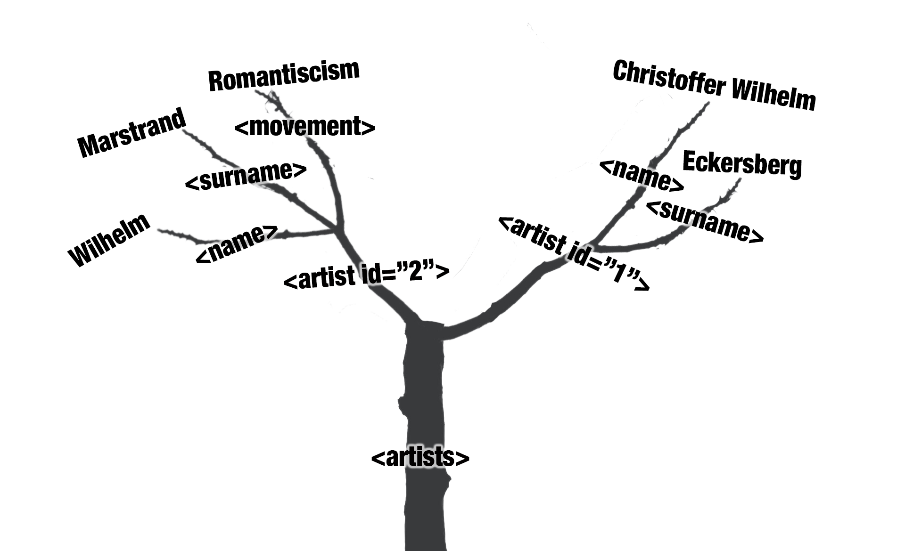
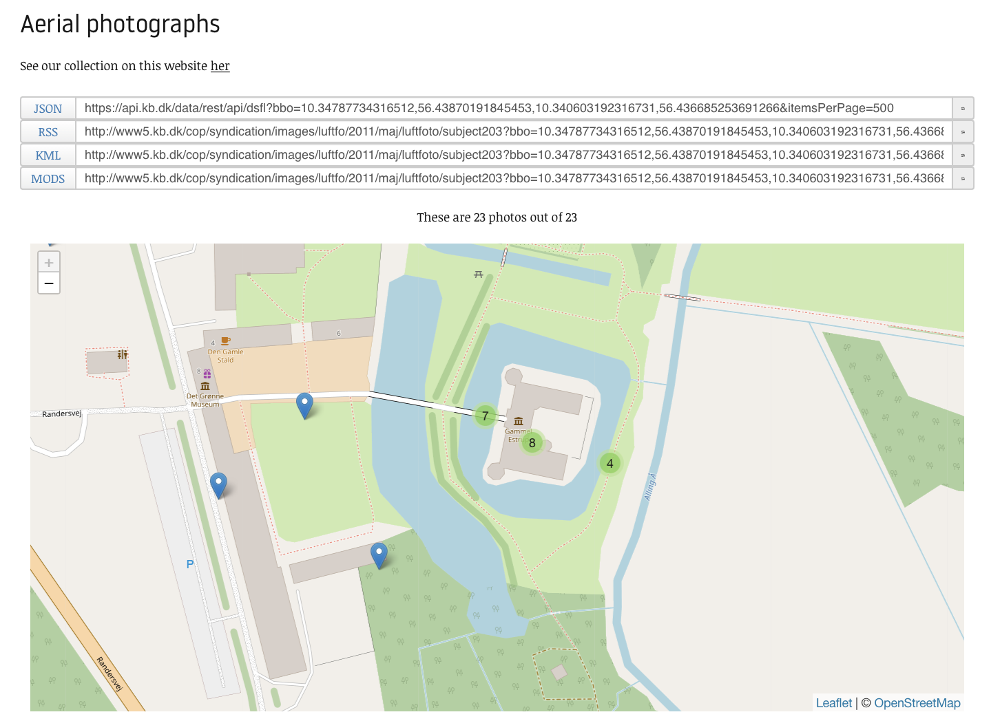

# Introduction

This R-markdown documents how to interact with the 'Danmark set fra Luften'-API using R. R-markdown is a format that combines explanatory text along with code thus making it possible to do thorough description of decisions in regards to the data processing.\
For further description of the R Markdown format see [R for Data Science, Chapter 27: R Markdown](https://r4ds.had.co.nz/r-markdown.html)

The primary objective of this R Markdown is to introduces the XML format. This is done by demonstrating how to load the aerial photo data into R through an API. In this particular case we have chosen to have the API give us our data in the XML(Extensible Markup Language)-format. Even though the API has the possibility to return in other formats we chose the XML-format since CSV and JSON already have been introduced in the previous lessons.

XML is a common way of exchanging data over the Web that stores data in an hierarchical structure.[\^1] A good argument for learning XML is that there is a lot of standard formats, which is based on XML.[\^2] One of these is the [Text Encoding Iniative(TEI)](https://tei-c.org/release/doc/tei-p5-doc/en/html/SG.html), which is a standard for representing digital texts. For instance a digital representation of a theatre play. In this case stage direction will be marked as such and lines will be marked as well as other relevant info about the role like name, age, gender etc. Another example of these XML-based standards, and the focal point of this lesson, is the standard [Keyhole Markup Language(KML)](https://www.ogc.org/pressroom/pressreleases/857), which is used for storing geographical data. But before venturing into KML-data it is a good idea to get familiarised with a simple XML-example:

```         
<?xml version="1.0" encoding="UTF-8"?>
<artists xmlns="https://chc.au.dk">
    <artist id="1">
        <name>Christoffer Wilhelm</name>
        <surname>Eckersberg</surname>
    </artist>
    <artist id="2">
        <name>Wilhelm</name>
        <surname>Marstrand</surname>
        <movement>Romanticism</movement>
    </artist>
</artists>
```

As mentioned before XML (and thus KML) is hierarchical. In the example above the top level is "artists". Beneath this level is the "artist"-level, which holds information about a given artist beneath it. In this example there are two artists. The information about the artists are "name" and "surname" and in the artist with ID 2 we also have the artistic movement. There could be several more information such as "birthday", "education", etc. The main thing here is "name" belongs under "artist" which belongs under "artists". These relationships can be described as parents and children. So "artist" is a child of "artists" and artists thus have two children: \<artist id:"1"\> and \<artist id:"2"\>. These likewise have children: <name>, <surname> and <movement>.

This relationship can also be imagined as tree with a root with branches:

 **Tree silhuet based on photo by** <a href="https://unsplash.com/es/@milatovar?utm_source=unsplash&utm_medium=referral&utm_content=creditCopyText">Mila Tovar</a> on <a href="https://unsplash.com/photos/AwrYS5jseMA?utm_source=unsplash&utm_medium=referral&utm_content=creditCopyText">Unsplash</a>

For further information and explanation of XML see page 42 in Munzert, Simon, Christian Rubba, Peter Meißner, and Dominic Nyhuis. *Automated Data Collection with R: a Practical Guide to Web Scraping and Text Mining*. New York: WILEY, 2014.

The mark-up language hierarchical structure is not really helpful in R, where data frames are preferred instead. I other words the data is wanted like this in R:

*artists* data frame:

| person_id | name                | surname    |   movement   |
|----------:|:--------------------|------------|:------------:|
|         1 | Christoffer Wilhelm | Eckersberg |      NA      |
|         2 | Wilhelm             | Marstrand  | Romantiscism |

<br>

This little example shows the fundamental task for this lesson.  This brief introduction to XML is by no means exhaustive, but will be elaborated more as the lesson progresses. One important thing to bear in mind is that this lesson isn't trying to be a comprehensive description of XML, but provide enough knowledge in order to wrangle the XML into a data frame structure. 

Before diving into the interaction with the API, the first challenge of this lesson is to parse the previous simple example into a R-data frame. As usually in R the first step is to load the relevant libraries.

# Loading libraries

R works with libraries that add different functionalities to the root of R functions. In this case, the relevant packages are:

```{r, message=FALSE}
library(xml2)
library(tidyverse)
```

For further information on these libraries see:\
<https://www.tidyverse.org/packages/>\
<https://xml2.r-lib.org>

As an initial step the simple example from before is loaded into R:

```{r}
artists <- read_xml('<?xml version="1.0" encoding="UTF-8"?>
<artists xmlns="https://chc.au.dk">
    <artist id="1">
        <name>Christoffer Wilhelm</name>
        <surname>Eckersberg</surname>
         <movement></movement>
    </artist>
    <artist id="2">
        <name>Wilhelm</name>
        <surname>Marstrand</surname>
        <movement>Romanticism</movement>
    </artist>
</artists>')
```


```{r}
artists
```
When exploring this xml-document through R we notice that the first line in cURLy brackets describes what type of document is at hand. Not surprisingly it says "xml document". The next line is the root of our xml-document followed by its two children.  
Before trying to extract names and surnames of the artists it is necessary to dwell on the root: 

> <artists xmlns="https://chc.au.dk">

The important thing here is the XML-namespace(xmlns) and has to do with the fact that XML is used in very different formats for different uses. Sometimes these formats are intertwined and a simple example would the attribute "id". It is easy to imagine two formats both containing an id-attribute and in this situation and in this situation it is important to tell the two from each other. This is where the namespace comes in. For more information on [XML Namespaces visit the W3 Consortium's recommendation](https://www.w3.org/TR/xml-names/#sec-intro).  

The xml2 package has a function for seeing namespaces in a given xml document:

```{r}
artists %>% 
  xml_ns()
```
This means that in the current situation the namespace is named d1. This will be important in a moment.  

Taking a step back the challenge is to use R to select the relevant elements and piece them together again as a data frame. But how is single elements of the XML targeted? The answer is Xpath(XML Path Language) in combination with the namespace. Xpath is used to define the path through the XML hierarchy to a given piece of information in the XML. In other words Xpath is a finger used to pointing a elements of interest. For more info see [W3 Consortium's recommendation on Xpath](https://www.w3.org/TR/xpath-31/).  

In this example the Xpath finger is pointing to the two surnames of our artists xml document. Notice how the namespace "d1" is prefixed to the element(surname). Thus two surname-elements are extracted:

```{r}
artists %>% 
  xml_find_all("//d1:surname")
```

The two surnames are still in the form of a xml nodeset and they are still xml elements. The next step is to extract the surnames as text:

```{r}
artists %>% 
  xml_find_all("//d1:surname") %>% 
  xml_text()
```
This way only the actual surnames are extracted and no longer as a xml nodeset, but as a vector. 

```{r}
artists %>% 
  xml_find_all("//@id") %>% 
  xml_text()
```


```{r}
artists %>% 
  xml_find_all("//d1:movement") %>% 
  xml_text()
```

```{r}
artists_df <- tibble(id = artists %>%  xml_find_all("//@id") %>% xml_integer(),
                     name = artists %>% xml_find_all("//d1:name") %>% xml_text(),
                     surname = artists %>% xml_find_all("//d1:surname") %>% xml_text(),
                     movement = artists %>%  xml_find_all("//d1:movement") %>% xml_text())

artists_df
```


# Loading the data

The data is delivered through the 'Danmark set fra Luften'-API as mentioned before. This is done with a request-URL leading to our data. In the previous lessons we have created the URL via the API's Swagger interfaces. However in the case of "Danmark set fra Luften"-API, there isn't a Swagger interface. Instead it has a somewhat minimal interface with four URL corresponding to the four formats that the API delivers.



By navigating the map the four URLs above changes. What changes in the URL is the coordinates used to specify what area to request data from. In this case we have defined an area around the old Manor house of Gl. Estrup from where we want all the aerial photos. For further information on constructing the request URL see the API documentation: <https://docs.google.com/document/pub?id=16daS_dAe2nrqCiZeOLb3N0GkfMalbJHAwQhMhWVy0UI>

The interfaces gives us this URL:

```         
http://www5.kb.dk/cop/syndication/images/luftfo/2011/maj/luftfoto/subject203?bbo=10.347597599029541,56.438728608888425,10.341149568557741,56.4367119455412&itemsPerPage=500&page=1&format=kml
```

Let us break down this URL to better understand it's composition:

Base URL:

```         
http://www5.kb.dk/cop/syndication/images/luftfo/2011/maj/luftfoto/subject203?
```

Bounding box(bbo) - a way of defining from which area you are interested in data from - here defined with coordinates. These four coordinates creates a square corresponding to the view of Gl. Estrup above.

```         
bbo=10.347597599029541,56.438728608888425,10.341149568557741,56.4367119455412
```

Since a bounding box can be as large as you like there can be alot of data points (aerial photos with metadata) within it. In order not to crash the system by sending a too large data package the data is organised in pages - here we define how many data points we want pr. page - Maximum is 5000.

```         
&itemsPerPage=500
```

The current page of the results.

```         
&page=1
```

The last part is where we specify what format we want the data in - here we have chosen kml - which is a flavour of XML.

```         
&format=kml
```

Next step is to load the data from the entire URL into R. We use the function `read_xml`for this and stores the data in a new element called 'estrup_xml':

```{r}
estrup_xml <- read_xml("http://www5.kb.dk/cop/syndication/images/luftfo/2011/maj/luftfoto/subject203?bbo=10.347597599029541,56.438728608888425,10.341149568557741,56.4367119455412&itemsPerPage=500&page=1&format=kml")
```

So right now we have our xml-document within R. Right beneath the _{xml_document}_ the format(kml) is specified with it's xml-namespace:

```{r}
estrup_xml
```

But it is still not in the data frame form that we want it to be in order to use the analytical powers of R. But before we can start this progress we need to inspect the structure of the xml-file. Otherwise we wont be able to identify which elements we are interested in extracting from the xml-document to our data frame. 
From the introduction we know that xml is hierarchical structured. This structure is commonly referred to as a family three, which is also the case with the `xml2`package functions, that we use here. Lets inspect our root of the estrup_xml:

```{r}
estrup_xml %>% 
  xml_root()
```

This the same as when we just typed the name 'estrup_xml'. Not suprisingly when just typing the estrup_xml, we get the root. Instead let's take a look at the roots children:

```{r}
estrup_xml %>% 
  xml_children()
```

So the root only have a single children. Document. We now inspect this children by it's number (1) in the `xml_child()`-function:

```{r}
estrup_xml %>% 
  xml_child(1)
```

"Documents" is parent to a whole lot more children - the interesting ones here is the "Placemark" - Lets examine one of these (number 8):

```{r}
estrup_xml %>% 
  xml_child(1) %>% 
  xml_child(8)
```

So it looks like "Placemark" is the child that contains the data points (aerial photos). But Placemark is also a parent of "ExtendedData"(number five). To keep an overview of the sitution comments about which child is what is added from now on:

```{r}
estrup_xml %>% 
  # The Document-child:
  xml_child(1) %>% 
  # The first Placemark-child:
  xml_child(8) %>% 
  # The ExtendedData-child: 
  xml_child(5)
```

So within ExtendedData we have thirteen types of metadata. Here the subjectGeographic(number 7) is targeted:

```{r}
estrup_xml %>% 
  # The Document-child:
  xml_child(1) %>% 
  # The first Placemark-child:
  xml_child(8) %>% 
  # The ExtendedData-child: 
  xml_child(5) %>% 
  # The subjectGeographic-child
  xml_child(7)
```

subjectGeographic only contains one child:

```{r}
estrup_xml %>% 
  # The Document-child:
  xml_child(1) %>% 
  # The first Placemark-child:
  xml_child(8) %>% 
  # The ExtendedData-child: 
  xml_child(5) %>% 
  # The subjectGeographic-child
  xml_child(7) %>% 
  # The value-child 
  xml_child(1) 
```

But the actual piece of information is still wrapped in a xml-tag. This is extracted with the function: `xml_text`.

```{r}
estrup_xml %>% 
  # The Document-child:
  xml_child(1) %>% 
  # The first Placemark-child:
  xml_child(8) %>% 
  # The ExtendedData-child: 
  xml_child(5) %>% 
  # The subjectGeographic-child
  xml_child(7) %>% 
  # The value-child 
  xml_child(1) %>% 
  # Extracting the text
  xml_text()
```

By changing the numerical value in the fourth `xml_child`-function to 8 the subjectImageSrc is returned (subjectThumbnailSrc is the eigth element under ExtendedData):

```{r}
estrup_xml %>% 
  # The Document-child:
  xml_child(1) %>% 
  # The first Placemark-child:
  xml_child(8) %>% 
  # The ExtendedData-child: 
  xml_child(5) %>% 
  # The subjectThumbnailSrc-child
  xml_child(8) %>% 
  # The value-child 
  xml_child(1) %>% 
  # Extracting the text
  xml_text()
```

This is the link to the thumbnail of the aerial photograph stored within the first Placemark:


The next step will be to utilise the insights gained in the previous section to extract all the childs of 'Placemark' and all the childs under 'ExtendedData' using Xpath.

# Parsing the xml file to a data frame using Xpath

Since the 'Placemark'-childs are some levels above the root of the xml-file the first thing we need to do is extract them.

First let's examine the first 'Placemark' once more:

```{r}
estrup_xml %>% 
  xml_child(1) %>% 
  xml_child(8)
```

The challenge is now to extract all the Placemark-childs instead of examining one at a time. As shown in the artist-example this is done with Xpath and the corresponding namespace. The `xml_ns()`function will provide the namespaces:

```{r}
estrup_xml %>% 
  xml_ns()
```
Apparently the document with the aerial photos contains a lot of namespaces, but further inspection shows that there are several duplicates among the namespaces. Since the document is in the kml-format only the first namespace, d1,  will be used: 

> d1     <-> http://www.opengis.net/kml/2.2

From the previous examination of the document it is know that Placemark is a child of Document. Using this knowledge in combination with the namespace and the `xml_find_all`-function every 22 Placemark is extracted: 

```{r}
estrup_xml %>% 
  xml_find_all("d1:Document/d1:Placemark")
```
Now that the xpath for targeting the 18 Placemark containing the aerial photos is in place, the next step is to start picking out single data element from the children of the Placemarks. For example (and in combination med `xml_text()` in order to get a vector instead of an xml_nodeset):

```{r}
estrup_xml %>% 
  xml_find_all("d1:Document/d1:Placemark/d1:name") %>% 
  xml_text()
```
If the desired information is stored within an attribute the situation is somewhat different:

```{r}
estrup_xml %>% 
  xml_find_all("d1:Document/d1:Placemark")
```
In this case the desired information is the id-attribute in the Placemark tag. The way to extract this similiar to the way before. Instead of `xml_text()` the function `xml_attr()` is supplied with the desired attribute-name:
```{r}
estrup_xml %>%
  xml_find_all("d1:Document/d1:Placemark") %>% 
  xml_attr("id")
```


Extracting data from ExtendedData-child of the Placemark-tag is somewhat more difficult to extract across all the Placemark-tag. ExtendedData has 13 children: 

```{r}
estrup_xml %>% 
  xml_find_first("d1:Document/d1:Placemark/d1:ExtendedData")
```
The problem here is that all these children are a Data-tag and since the previous method of using Xpath to point at elements of interest has been pointing at tags. Using this method every Data point from each of the 22 Placemarks are returned:
```{r}
estrup_xml %>% 
  xml_find_all("d1:Document/d1:Placemark/d1:ExtendedData/d1:Data")
```
What is unique about these Data tags is their name-attribute's value. Thus the solution is to select Data-tag with a given name-attribute-value. E.g. subjectCreationDate:

```{r}
estrup_xml %>%  
  xml_find_all('d1:Document/d1:Placemark/d1:ExtendedData/d1:Data[@name="subjectCreationDate"]')
```


The three previous examples extracting data using Xpath in combination with `xml_text()` and `xml_attr()` can easy be incorporated into the `tibble()`-function i order to create a data frame: 

```{r}
tibble(
  id = estrup_xml %>%
    xml_find_all("d1:Document/d1:Placemark") %>% 
    xml_attr("id"),
  name = estrup_xml %>% 
    xml_find_all("d1:Document/d1:Placemark/d1:name") %>% 
    xml_text(),
  subjectCreationDate = estrup_xml %>%  
    xml_find_all('d1:Document/d1:Placemark/d1:ExtendedData/d1:Data[@name="subjectCreationDate"]') %>% 
    xml_text()
  )
```

Using the knowledge from this lesson it is possible to create a larger data frame that holds all the data from the Placemarks:

```{r}
tibble(
  id = estrup_xml %>%  xml_find_all("d8:Document/d8:Placemark") %>% xml_attr("id"),
  name = estrup_xml %>% xml_find_all("d8:Document/d8:Placemark/d8:name") %>% xml_text(),
  link = estrup_xml %>% xml_find_all("d8:Document/d8:Placemark/atom:link") %>%  xml_attr("href"),
  coordinates = estrup_xml %>% xml_find_all("d8:Document/d8:Placemark/d8:Point/d8:coordinates") %>%  xml_text(),
  subjectLink = estrup_xml %>% xml_find_all(
    "d8:Document/d8:Placemark/d8:ExtendedData/d8:Data[@name='subjectLink']"
  ) %>% xml_text(),
  subjectName = estrup_xml %>% xml_find_all(
    "d8:Document/d8:Placemark/d8:ExtendedData/d8:Data[@name='subjectName']"
  ) %>% xml_text(),
  subjectCreatorName = estrup_xml %>% xml_find_all(
    "d8:Document/d8:Placemark/d8:ExtendedData/d8:Data[@name='subjectCreatorName']"
  ) %>% xml_text(),
  subjectCreationDate = estrup_xml %>% xml_find_all(
    "d8:Document/d8:Placemark/d8:ExtendedData/d8:Data[@name='subjectCreationDate']"
  ) %>% xml_text(),
  subjectGenre = estrup_xml %>% xml_find_all(
    "d8:Document/d8:Placemark/d8:ExtendedData/d8:Data[@name='subjectGenre']"
  ) %>% xml_text(),
  subjectNote = estrup_xml %>% xml_find_all(
    "d8:Document/d8:Placemark/d8:ExtendedData/d8:Data[@name='subjectNote']"
  ) %>% xml_text(),
  subjectGeographic = estrup_xml %>% xml_find_all(
    "d8:Document/d8:Placemark/d8:ExtendedData/d8:Data[@name='subjectGeographic']"
  ) %>% xml_text(),
  subjectImageSrc = estrup_xml %>% xml_find_all(
    "d8:Document/d8:Placemark/d8:ExtendedData/d8:Data[@name='subjectImageSrc']"
  ) %>% xml_text(),
  subjectThumbnailSrc = estrup_xml %>% xml_find_all(
    "d8:Document/d8:Placemark/d8:ExtendedData/d8:Data[@name='subjectThumbnailSrc']"
  ) %>% xml_text(),
  recordCreationDate = estrup_xml %>% xml_find_all(
    "d8:Document/d8:Placemark/d8:ExtendedData/d8:Data[@name='recordCreationDate']"
  ) %>% xml_text(),
  recordChangeDate = estrup_xml %>% xml_find_all(
    "d8:Document/d8:Placemark/d8:ExtendedData/d8:Data[@name='recordChangeDate']"
  ) %>% xml_text(),
  correctness = estrup_xml %>% xml_find_all(
    "d8:Document/d8:Placemark/d8:ExtendedData/d8:Data[@name='correctness']"
  ) %>% xml_text(),
  interestingness = estrup_xml %>% xml_find_all(
    "d8:Document/d8:Placemark/d8:ExtendedData/d8:Data[@name='interestingness']"
  ) %>% xml_text()
)  
```


