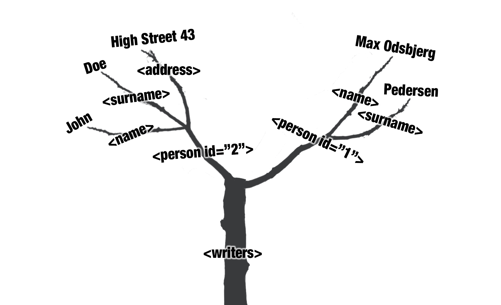

# Introduction
This R-markdown documents how to interact with the 'Danmark set fra Luften'-API using R. R-markdown is a format that combines explanatory text along with code thus making it possible to do thorough description of decisions in regards to the data processing.  
For further description of the R Markdown format see [R for Datatscience, Chapter 27: R Markdown](https://r4ds.had.co.nz/r-markdown.html)  

The primary objective of this R Markdown is to introduces the XML format. This is done by demonstrating how to load the aerial photo data into R through an API. In this particular case we have chosen to have the API give us our data in the XML(Extensible Markup Language)-format. Even though the API has the possibility to return in other formats we chose the XML-format since CSV and JSON already have been introduced in the previous lessons. 

XML is a common way of exchanging data over the Web that stores data in an hierarchical structure.[^1] A good argument for learning XML is that there is a lot of standard formats, which is based on XML.[^2] One of these is the [Text Encoding Iniative(TEI)](https://tei-c.org/release/doc/tei-p5-doc/en/html/SG.html), which is a standard for representing digital texts. For instance a digital representation of a theatre play. In this case stage direction will be marked as such and lines will be marked as well as other relevant info about the role like name, age, gender etc.  Another example of these XML-based standards, and the focal point of this lesson, is the standard [Keyhole Markup Language(KML)](https://www.ogc.org/pressroom/pressreleases/857), which is used for storing geographical data. But before venturing into KML-data it is a good idea to get familiarised with a simple XML-example:

```{}
<?xml version="1.0" encoding="UTF-8"?>
<writers xmlns="https://chc.au.dk">
    <person id="1">
        <name>Max Odsbjerg</name>
        <surname>Pedersen</surname>
    </person>
    <person id="2">
        <name>John</name>
        <surname>Doe</surname>
        <address>High Street 43</address>
    </person>
</writers>
```
As mentioned before XML (and thus KML) is hierarchical. In the example above the top level is "writers". Beneath this level is the "person"-level, which holds information about a given person beneath it. In this example we have two persons. The information about the persons is "name" and "surname" and in the person with ID 2 we also have the address. There could be several more information such as "phone", "e-mail", etc. The main thing here is "name" belongs under "person" which belongs under "writers". These relationships can be described as parents and children. So "person" is a child of "writers" and writers thus have two children: <person id:"1"> and <person id:"2">. These also have children: <name>, <surname> and <address>. This relationship can also be imagined as tree with a root with branches: 


**Tree silhuet based on photo by <a href="https://unsplash.com/es/@milatovar?utm_source=unsplash&utm_medium=referral&utm_content=creditCopyText">Mila Tovar</a> on <a href="https://unsplash.com/photos/AwrYS5jseMA?utm_source=unsplash&utm_medium=referral&utm_content=creditCopyText">Unsplash</a>**
  

For further information and explanation of XML see page 42 in Munzert, Simon, Christian Rubba, Peter Meißner, and Dominic Nyhuis. *Automated Data Collection with R: a Practical Guide to Web Scraping and Text Mining*. New York: WILEY, 2014.

The mark-up language hierarchical structure is not really helpful in R, where dataframes are preferred instead. I other words we want our data like this in R:

*writers* dataframe:

|person_id|name|surname|adress|
|------:|:-----|---------|:------:|
|1|Max Odsbjerg|Pedersen|NA|
|2|John|Doe|High Street 43|
<br>

This little example shows the fundamental task that we are performing in this lesson. This brief introduction to XML is by no means exhaustive, but will be elaborated more when we read in our KML-data. One important thing to bear in mind is that this lesson isn't trying to be a comprehensive description of XML, but provide enough knowledge in order to wrangle the XML into a dataframe structure.  

# Loading libraries
R works with libraries that add different functionalities to the root of R functions. In this case, the relevant packages are:
```{r, message=FALSE}
library(xml2)
library(tidyverse)
```
For further information on these libraries see:  
https://www.tidyverse.org/packages/  
https://xml2.r-lib.org


But how do we target the information in the XML in order to extract it into a dataframe in R?  The answer is Xpath which is a expressions languages that can be used to target specific elements in a XML-file. In order to get a sense of Xpath the initial example of a simple XML-language is loaded into R:

```{r}
writers <- read_xml('<writers >
    <person id="1">
        <name>Max Odsbjerg</name>
        <surname>Pedersen</surname>
    </person>
    <person id="2">
        <name>John</name>
        <surname>Doe</surname>
        <address>High Street 43</address>
    </person>
</writers>')
```

```{r}
writers
```
```{r}
writers %>% 
  xml_find_all("//name")
```


# Loading the data
The data is delivered through the 'Danmark set fra Luften'-API as mentioned before. This is done with a request-URL leading to our data. In the previous lessons we have created the the URL via the API's Swagger interfaces. However in the case of "Danmark set fra Luften"-API, there isn't a Swagger interface. Instead it has a somewhat minimal interface with four URL corresponding to the four formats that the API delivers. 


By navigating the map the four URLs above changes. What changes in the URL is the coordinates used to specify what area to request data from. In this case we have defined an area around the old Manor house of Gl. Estrup from where we want all the aerial photos. Fur further information on constructing the request URL see the API documentation: https://docs.google.com/document/pub?id=16daS_dAe2nrqCiZeOLb3N0GkfMalbJHAwQhMhWVy0UI

The interfaces gives us this URL: 

```{}
http://www5.kb.dk/cop/syndication/images/luftfo/2011/maj/luftfoto/subject203?bbo=10.347597599029541,56.438728608888425,10.341149568557741,56.4367119455412&itemsPerPage=500&page=1&format=kml
```

Let us break down this URL to better understand it's composition: 

Base URL:
```{}
http://www5.kb.dk/cop/syndication/images/luftfo/2011/maj/luftfoto/subject203?
```

Bounding box(bbo) - a way of defining from which area you are interested in data from - here defined with coordinates. These four coordinates creates a square corresponding to the view of Gl. Estrup above.
```{}
bbo=10.347597599029541,56.438728608888425,10.341149568557741,56.4367119455412
```
Since a bounding box can be as large as you like there can be alot of data points (aerial photos with metadata) within it. In order not to crash the system by sending a too large data package the data is organised in pages - here we define how many data points we want pr. page - Maximum is 5000. 
```{}
&itemsPerPage=500
```

The current page of the results.
```{}
&page=1
```

The last part is where we specify what format we want the data in - here we have chosen kml - which is a flavour of XML.
```{}
&format=kml
```

Next step is to load the data from the entire URL into R. We use the function `read_xml`for this and stores the data in a new element called 'estrup_xml': 

```{r}
estrup_xml <- read_xml("http://www5.kb.dk/cop/syndication/images/luftfo/2011/maj/luftfoto/subject203?bbo=10.347597599029541,56.438728608888425,10.341149568557741,56.4367119455412&itemsPerPage=500&page=1&format=kml")
```

So right now we have our xml-document within R:
```{r}
estrup_xml
```

But it is still not in the dataframe form that we want it to be in order to use the analytical powers of R. But before we can start this progress we need to inspect the structure of the xml-file. Otherwise we wont be able to identify which elements we are interested in extracting from the xml-document to our dataframe.  
From the introduction we know that xml is hierarchical structured. This structure is commonly referred to as a family three, which is also the case with the `xml2`package functions, that we use here. Lets inspect our root of the estrup_xml:

```{r}
estrup_xml %>% 
  xml_root()
```
This the same as when we just typed the name 'estrup_xml'. Not suprisingly when just typing the estrup_xml, we get the root. Instead let's take a look at the roots children:

```{r}
estrup_xml %>% 
  xml_children()
```
So the root only have a single children. Document. We now inspect this children by it's number (1) in the `xml_child()`-function:

```{r}
estrup_xml %>% 
  xml_child(1)
```
"Documents" is parent to a whole lot more children - the interesting ones here is the "Placemark" - Lets examine one of these (number 8):

```{r}
estrup_xml %>% 
  xml_child(1) %>% 
  xml_child(8)
```
So it looks like "Placemark" is the child that contains the data points (aerial photos). But Placemark is also a parent of "ExtendedData"(number five). To keep an overview of the sitution comments about which child is what is added from now on:

```{r}
estrup_xml %>% 
  # The Document-child:
  xml_child(1) %>% 
  # The first Placemark-child:
  xml_child(8) %>% 
  # The ExtendedData-child: 
  xml_child(5)
```

So within ExtendedData we have thirteen types of metadata. Here the subjectGeographic(number 7) is targeted:

```{r}
estrup_xml %>% 
  # The Document-child:
  xml_child(1) %>% 
  # The first Placemark-child:
  xml_child(8) %>% 
  # The ExtendedData-child: 
  xml_child(5) %>% 
  # The subjectGeographic-child
  xml_child(7)
```
subjectGeographic contain only one child: 
```{r}
estrup_xml %>% 
  # The Document-child:
  xml_child(1) %>% 
  # The first Placemark-child:
  xml_child(8) %>% 
  # The ExtendedData-child: 
  xml_child(5) %>% 
  # The subjectGeographic-child
  xml_child(7) %>% 
  # The value-child 
  xml_child(1) 
```

But the actual piece of information is still wrapped in a xml-tag.  This is extracted with the function: `xml_text`. 

```{r}
estrup_xml %>% 
  # The Document-child:
  xml_child(1) %>% 
  # The first Placemark-child:
  xml_child(8) %>% 
  # The ExtendedData-child: 
  xml_child(5) %>% 
  # The subjectGeographic-child
  xml_child(7) %>% 
  # The value-child 
  xml_child(1) %>% 
  # Extracting the text
  xml_text()
```

By changing the numerical value in the fourth `xml_child`-function to 8 the subjectImageSrc is returned (subjectThumbnailSrc is the eigth element under ExtendedData):
```{r}
estrup_xml %>% 
  # The Document-child:
  xml_child(1) %>% 
  # The first Placemark-child:
  xml_child(8) %>% 
  # The ExtendedData-child: 
  xml_child(5) %>% 
  # The subjectThumbnailSrc-child
  xml_child(8) %>% 
  # The value-child 
  xml_child(1) %>% 
  # Extracting the text
  xml_text()
```
This is the link to the thumbnail of the aerial photograph stored within the first Placemark:


The next step will be to utilise the insights gained in the previous section to extract all the childs of 'Placemark' and all the childs under 'ExtendedData'.  

# Parsing the xml file to a dataframe using our knowledge of xml-childs and parents

Since the 'Placemark'-childs are some levels above the root of the xml file the first thing we need to do is extract them.  

First let's examine the first 'Placemark' once more:

```{r}
estrup_xml %>% 
  xml_child(1) %>% 
  xml_child(8)
```
 
 
```{r}
estrup_xml %>% 
  xml_child(1) %>% 
  xml_child(9)
```
But how can all the Placemark-childs be extracted in once? The answer is Xpath which is a expressions languages that can be used to target specific elements in a XML-file. In order to get a sense of Xpath the initial example of a simple XML-language is loaded into R:


Xpath 

```{r}
xml_ns(estrup_xml)
```

```{r}
estrup_xml %>% 
  xml_find_all("//d1:Placemark")
```

```{r}
estrup_xml %>% 
  xml_find_all('//*[@id]') %>% 
  xml_attr("id")
```

The idea of extracting these values is that they can be used as xPaths themselves to extract the information that we are interested in. Lets save these values to an object:

```{r}
estrup_xml %>% 
  xml_find_all('//*[@id]') %>% 
  xml_attr("id") -> objects
```

We will now use these object to create our initial data frame from which we will extract the data into. Since the first value in the list above is "ballon-style", which doesn't derive from a 'Placemark' we use the `slice` function to cut out the first value: 

```{r}
tibble(obj = objects) %>% 
  slice(2:n()) -> estrup_df
```

Let's examine our initial dataframe: 

```{r}
estrup_df
```
We now have 200 rows containing each an object value corresponding to a 'Placemark'. These values canb be used as an xPath which we use to extract the xml-nodeset of the particular 'Placemark' we also extract the nodeset of 'ExtendedData:
```{r}
estrup_df %>% 
  rowwise() %>% 
  mutate(obj_nodeset = list(estrup_xml %>% 
                          xml_find_all(paste0('//*[@id="', obj, '"]')))) %>% 
   mutate(Extended_data_node = list(estrup_xml %>% 
                          xml_find_all(paste0('//*[@id="', obj, '"]')) %>% 
                            xml_child(5)))
```
Now that we have the nodesets within the dataframe we can extract the elements we want: 

```{r}
estrup_df %>% 
  rowwise() %>% 
  mutate(obj_nodeset = list(estrup_xml %>% 
                          xml_find_all(paste0('//*[@id="', obj, '"]')))) %>% 
   mutate(Extended_data_node = list(estrup_xml %>% 
                          xml_find_all(paste0('//*[@id="', obj, '"]')) %>% 
                            xml_child(5))) %>% 
  mutate(name = xml_child(obj_nodeset, 1) %>% 
                  xml_text(),
         style = xml_child(obj_nodeset, 2) %>% 
                  xml_text(),
         link = xml_child(obj_nodeset, 3) %>% 
                  xml_attr("href"),
         point = xml_child(obj_nodeset, 4) %>% 
                  xml_text()) %>% 
#Getting the extended Data
mutate(subjectLink = xml_child(Extended_data_node, 1) %>% 
                        xml_text(),
       subjectSubjectName = xml_child(Extended_data_node, 2) %>% 
                              xml_text(),
       subjectCreatorName = xml_child(Extended_data_node, 3) %>% 
                              xml_text(),
       subjectCreationDate = xml_child(Extended_data_node, 4) %>% 
                              xml_text(),
       subjectGenre = xml_child(Extended_data_node, 5) %>% 
                              xml_text(),
       subjectNote = xml_child(Extended_data_node, 6) %>% 
                              xml_text(),
       subjectGeographic = xml_child(Extended_data_node, 7) %>% 
                              xml_text(),
       subjectImageSrc = xml_child(Extended_data_node, 8) %>% 
                              xml_text(),
       subjectThumbnailSrc = xml_child(Extended_data_node, 9) %>% 
                              xml_text(),
       recordCreationDate = xml_child(Extended_data_node, 10) %>% 
                              xml_text(),
       recordChangeDate = xml_child(Extended_data_node, 10) %>% 
                              xml_text(),
       correctness = xml_child(Extended_data_node, 12) %>% 
                              xml_text(),
       interestingness = xml_child(Extended_data_node, 13) %>%
                              xml_text()) %>% 
  #dropping the nodesets since we are done with them
  select(-obj_nodeset, -Extended_data_node)-> estrup_parsed
```

Let's see what we got: 
```{r}
estrup_parsed
```
