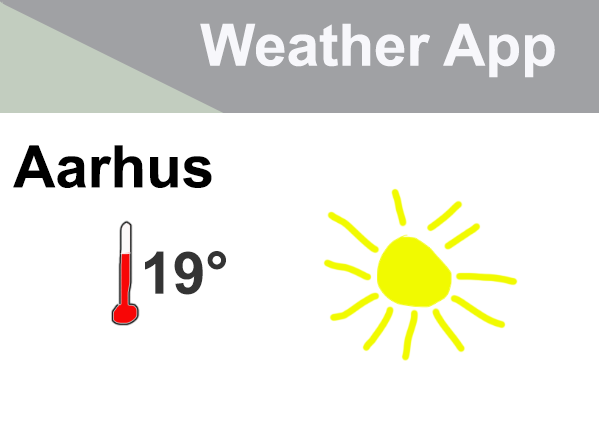

An API is a way for machines to interact with eachother and exchange data. In this course we are interested in extracting data to do somekind of analysis on. Thus our goal here is to interact with an API as humans. However APIs are for machines to talk with machines. We therefore need to have a machine that we control to talk with the API. This could be a Python-script, R-script or Julia-script. More on concrete examples later. For now we will just note that APIs are for machines to talk to eachother. When we from now on talk about interacting with APIs, we know that we are interacting with an API through a machine - in this case the coding language we work in. 

Let's take a step back now and forget about coding languages for a minute and instead focus on a simple exampel of an API at work. Behold a weather app:

We all have better looking ones on our phones and they update throughout the day with the most recent information. One might be tempted to say that the app changes along with the weather, but it doesn't - the data supplied to it changes. How is this data then supplied? Of course through an API! But where does the data come from? In our case we imagine that it is coming from a weather service.

This weather service has a massive database with temperatures for several cities, humidity, cloudcover, UV-index and lots and lots more. In other words it is a machine that holds alot of data. But take a look of our app - it just shows the location, temperature and the cloudcover. One could of course transfer the entire data from the weather service database and the app could filter and get the needed data it self. But this would be heavy both because it takes time and storage to transfer and hold the entire database - and just imagine if you were to transfer and store the entire database each time you wanted a new weatherforecast. Instead of doing this we have APIs, which stands between the weather app and the weather service's massive weather database. This API knows it's way around the weather database. Thus the weather app can ask the API for exactly what it needs and nothing else:

*Dear weather service API - can you give the me temperature and the cloud cover for Aarhus?* 

It is wery little information that is transfered and it takes almost nothing to store. The weather app doesn't need to handle any filtering of the data and the data is returned in a way the weather app knows how to intepret.  Since the transfer through the API is leight weight it can be asked for the data every five minute or perhaps even every second. This depends on the API. It might have rules saying something like "You can only ask me once an hour" or "I can only answer five weather apps a second - everyone else will have to wait". 

This is an example of how an API could operate, but APIs varies in methods, how they respond and how accessible they are. Lets for now turn our focus on the accessibility. 

## Accessibility
APIs varies in accessibility in different ways. Some APIs are hidden away and are not meant for anyones eyes except for a few developers. This could both be APIs that exchange data over the internet, like our weather app before, but also API that exchanges data within a local IT-system eg. in a company's local software controlling production. Common for both web APIs and local APIs is that they live a quiet life where they exchange information. These APIs would be hidden so far down in the source code that only developers would be able to look it up and in terms of local APIs - only developers with local access. Let's forget about local APIs for now. In this lesson we are only interested in web APIs 

Web APIs also varies in accessibility - some are only meant for keeping things running in a information technological system - like the weather app. Others are meant to provide service and data to a broader variety of users and cases. This type of APIs again varies in accessibility in terms of how open they are. In the three case studies in this lesson we will be using APIs that are accessibel for everyone. But you should be aware that there are other APIs out there that require that you either register for the service or register and pay for the service. An example of a paid API is the Twitter API. The more you pay the more data and the faster you are able to extract it. However Twitter also has a solution, where researchers can get access to an API for free. In both cases the API needs a way to validate that you are who you are - that you are indeed the researcher or that you have paid. These kind of APIs can be a more tricky to interact with depending on which kind of authentication they use. But this will be very specific to the given API and there not discussed here since the use cases in this lessons draws upon APIs that needs no authentication. 

APIs that are meant for accessing will in most cases have some kind of documentation. These documentations vary in their quality and how descriptive they are. Most often they are written by developers for developers thus having some core assumptions of a shared informational technological understanding. Because of this documentation can be somewhat difficult to read by mortals. However the documentation should always be the point of departure for interacting with an API, which in our case means extracting data. Hopefully this lesson will make it easier to read these kinds of documentations. One good rule of thumb however is to look for example of usage and then try to tinker those examples in the direction you want. Many of the API documentations will even have interfaces that help you interact with the API. We will look more into these is the case studies. Before we venture into these concrete examples we need to have a general look into the technical way our APIs of interest work.  

## Web APIs - what does that mean? 
Web APIs are APIs that distributes data and services via the web in the same way that websites are loaded when you surf the internet. Nowadays being online is such a normal thing, that most people doensn't give the techincal aspects any thoughs. 