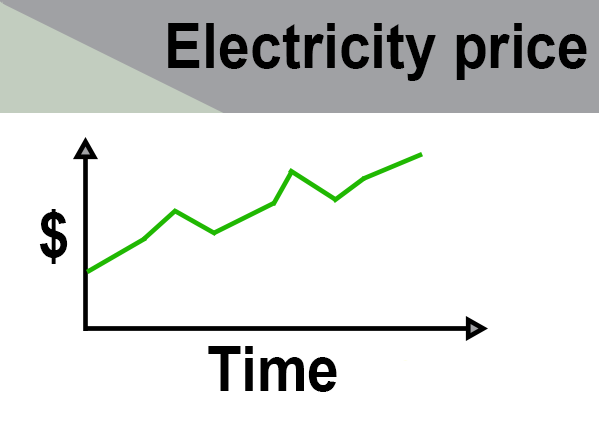

An API is a way for machines to interact with each other and exchange data. In this course we are interested in extracting data to do some kind of analysis on. Thus our goal here is to interact with an API as humans. However APIs are for machines to talk with machines. We therefore need to have a machine that we control to talk with the API. This could be a Python-script, R-script or Julia-script. More on concrete examples later. For now we will just note that APIs are for machines to talk to each other. When we from now on talk about interacting with APIs, we know that we are interacting with an API through a machine - in this case the coding language we work in. 

Let's take a step back now and forget about coding languages for a minute and instead focus on a simple example of an API at work. Behold an electricity price app:



If you have one on our phone it probably looks better and will update throughout the day with the most recent information. One might be tempted to say that the app changes along with the prices, but it doesn't - the data supplied to it changes. How is this data then supplied? Of course through an API! But where does the data come from? In this case we imagine that it is coming from a public owned company that runs the energy net.

This company has a massive database with electricity prices, CO2-emissions, wind mill production, gas supply and much more. In other words it is a machine that holds a lot of data. But take a look of our app - it just shows the electricity price trend. One could of course transfer the entire data from the company's database and the app could filter and get the needed data itself. But this would be heavy both because it takes time and storage to transfer and hold the entire database - and just imagine if you were to transfer and store the entire database each time you wanted the newest trend in electricity price. Instead of doing this we have APIs, which stands between the electricity price app and the company's massive energy database. This API knows it's way around the company's database. Thus the electricity price app can ask the API for exactly what it needs and nothing else:

*Dear energy network API - can you give me the latest 24 hours of electricity prices?* 

It is very little information that is transferred and it takes almost nothing to store. The electricity price app doesn't need to handle any filtering of the data and the data is returned in a way the app knows how to interpret.  Since the transfer through the API is light weight it can be asked for the data every five minute or perhaps even every second. This depends on the API. It might have rules saying something like "You can only ask me once an hour" or "I can only answer five apps a second - everyone else will have to wait". 

This is an example of how an API could operate, but APIs varies in methods, how they respond and how accessible they are. For now the focus will be on the accessibility. 

## Accessibility
APIs varies in accessibility in different ways. Some APIs are hidden away and are not meant for anyone’s eyes except for a few developers. This could both be APIs that exchange data over the internet, like the electricity price app before, but also APIs that exchanges data within a local IT-system eg. in a company's local software controlling production. Common for both web APIs and local APIs is that they live a quiet life where they exchange information. These APIs would be hidden so far down in the source code that only developers would be able to look it up and in terms of local APIs - only developers with local access. Let's forget about local APIs for now. In this lesson we are only interested in web APIs 

Web APIs also varies in accessibility - some are only meant for keeping things running in an information technological system - like the electricity price app. Others are meant to provide service and data to a broader variety of users and cases. This type of APIs again varies in accessibility in terms of how open they are. The three case studies in this lesson will be using APIs that are accessible for everyone. But you should be aware that there are other APIs out there that require that you either register for the service or register and pay for the service. An example of a paid API is the Twitter API. The more you pay the more data and the faster you are able to extract it. However Twitter also has a solution, where researchers can get access to an API for free. In both cases the API needs a way to validate that you are who you are - that you are indeed the researcher or that you have paid. These kind of APIs can be a more tricky to interact with depending on which kind of authentication they use. But this will be very specific to the given API and there fore not discussed here since the use cases in this lessons draws upon APIs that needs no authentication. 

APIs that are meant for accessing will in most cases have some kind of documentation. These documentations vary in their quality and how descriptive they are. Most often they are written by developers for developers thus having some core assumptions of a shared informational technological understanding. Because of this documentation can be somewhat difficult to read by mortals. However the documentation should always be the point of departure for interacting with an API, which in our case means extracting data. Hopefully this lesson will make it easier to read these kinds of documentations. One good rule of thumb however is to look for example of usage and then try to tinker those examples in the direction you want. Many of the API documentations will even have interfaces that help you interact with the API. We will look more into these is the case studies. Before we venture into these concrete examples we need to have a general look into the technical way our APIs of interest work.  


## Web APIs - what does that mean? 
Web APIs are APIs that distributes data and services via the web in the same way that websites are loaded when you surf the internet. Nowadays being online is such a normal thing, that most people don't give the technical aspects any thoughts. In this section we will cover a light walk through of how the web works. This is to create a basic understanding of what happens when Web APIs transfers data to your computer. 

Wikipedia's definition of the [World Wide Web](https://en.wikipedia.org/wiki/World_Wide_Web)(or just plainly the Web) is an information systems that allows documents to be shared over the [internet](https://en.wikipedia.org/wiki/Internet). Most people won't distinguish between the web and the internet. A total definition of how these to interact is out of the scope of this lesson, but one should be aware that the internet is not just what is going on in your [web browser](https://en.wikipedia.org/wiki/Web_browser)(such as Google Chrome or Firefox).  

A deeper understanding of what happens in your browser is however a great point pf departure to better understand how Web APIs work. Visiting a website in their browser is typically what people identifies with the web. Remembering the Wikipedia-definition of the web as an information system that shares documents over the internet, visiting a website in your browser is exactly that. Typing the address of the website you want to visit is the same thing as requesting a document over the internet. Typically a hypertext mark-up language document(commonly know as html-file) is associated with the address of the web page and this html-file is then send to your browser which renders a graphical version of the html-document. This is very simplified what happens when visiting a website. In most cases a lot more than just an html-file is transferred. This could be images to be shown on the page, stylesheets with color-definition, JavaScript for creating interactivity on the page and much more. A walk through of how modern webpages is created and rendered is outside the scope of this lesson and thus for now we will focus on two aspect of getting documents over the web: 

* the address to the document - it's [Uniform Resource Locator(URL)](https://en.wikipedia.org/wiki/URL)
* [Hypertext Transfer Protocol](https://en.wikipedia.org/wiki/Hypertext_Transfer_Protocol)

These two terms are intertwined. Most people knows URL as web addresses and that they look something like this: 

> stackoverflow.com

The name of the website followed by some kind of extension like _.com_ or _.de_. This is in principle the URL, but this is not all. When typing _stackoverflow.com_ into the address field of most modern browsers something more will be appended to the URL: 

>https://stackoverflow.com

The _https://_-addition is an abbreviation of _hypertext transfer protocol secure_, which is the method of using the internet to getting. Https is built as client-server and we have actually already explained this process without mentioning the https: The client is a browser through which a request of a resource(the URL-address) is send to a server. The server then responds with the requested document if it is found. Most of us have experienced following a link on a webpage and the seeing a page saying "404 Not Found" - this is when the requested document is not found. If it is found the code is 200, but this is not seen since the requested document i shown instead. So let’s break it down into pieces:

1. Typing in _en.wikipedia.org/wiki/Bear_ in URL-address bar in a browser 
2. The browser then adds _https://en.wikipedia.org/wiki/Bear_ 
3. A request is then sent from the browser through the hypertext transfer protocol requesting Wikipedia’s servers for the document affiliated with the address
4. Wikipedia then responds with the file - often a html-document which is then rendered in the browser

This system of request and response can also return other documents than just html files. This link e.g. return an image in the form of a jpeg-file(notice the file extension un the URL): 
> https://upload.wikimedia.org/wikipedia/commons/thumb/e/ea/Plithocyon_armagnacensis.JPG/220px-Plithocyon_armagnacensis.JPG

This system can there for just as easily return data files and Web APIs works the exact same way. The only difference is that our requests sent over http via the URL becomes somewhat more tricky. 

Let’s take a look at a very simple Web API, one that we will be working with as an example later on. This API delivers public data from the Royal Danish Library's newspaper collection and one of its simplest function is to look up how many articles a certain term appears in. Let's say we want to know how many articles Danish newspaper collection contains the word _internet_

1. We send the following URL in address bar of a browser[https://labs.statsbiblioteket.dk/labsapi/api/aviser/hits?query=internet](https://labs.statsbiblioteket.dk/labsapi/api/aviser/hits?query=internet)
2. A request is then sent from the browser through the hypertext transfer protocol requesting The Royal Danish Library servers to look up how many times "internet" appears in the newspapers articles. 
3. The servers then performs a search on "internet" in the newspaper collection and once the result is ready it is send back to the browser as a data-file. In our case a JSON-file(more on this later - or not - check with other materials). 

The datafile returned from step 3. looks like this: 
```{"restricted":504150,"public":131}```

Due to copyright a large part of the newspaper collections is restricted on access. So the response tells us how many hits are restricted and how many are public available. The response is human readable, but also machine readable - notice the cURLy brackets and other notations. This is a very simple example of the JSON-data format. JSON is one of the very common data format that web-APIS returns their responses in. Three very common data formats returned by web-APIs are : Comma Separated Values(CSV), JavaScript Object Notation(JSON), and Extensible Markup Language(XML). These has also been selected for the three case studies that we will dive into next. Before venturing on it is highly recommended that you return to [Lesson 6 - CSV files and JSON data](https://github.com/CHCAA-EDUX/Programming-for-the-Humanities-E22/blob/main/lesson/lesson_06.md) and brush up the general explanations of CSV and JSON